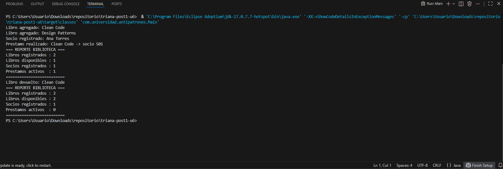

# U6 Post-Contenido 1 - De God Object a SRP

## Objetivo
Refactorizar un God Object aplicando SRP (Principio de Responsabilidad Unica), separando responsabilidades de catalogo, socios, prestamos y reportes.

## Estructura clave
- `GestorBiblioteca`: version inicial con antipatron God Object (conservada).
- `Libro`, `Socio`: clases de dominio.
- `CatalogoLibros`, `RegistroSocios`, `ServicioPrestamos`, `GeneradorReportes`: clases especializadas.
- `Main`: flujo refactorizado.

## Ejecutar
```bash
mvn clean compile
mvn exec:java
```

## Responsabilidades identificadas (SRP)
1. Gestion de catalogo de libros.
2. Gestion de socios.
3. Gestion de prestamos.
4. Generacion de reportes.

## Resultado esperado
Se mantiene la funcionalidad original, pero con responsabilidades separadas y dependencias por constructor donde aplica.

## Evidencias de Verificacion (2026-04-17 16:26:56)

| Checkpoint | Estado | Evidencia |
|---|---|---|
| Compila sin errores (mvn compile) | PASS | mvn -q -DskipTests compile |
| Clase God Object original presente | PASS | GestorBiblioteca.java |
| Existen 4 clases especializadas | PASS | CatalogoLibros, RegistroSocios, ServicioPrestamos, GeneradorReportes |
| Existen clases de dominio Libro y Socio | PASS | Libro.java y Socio.java |
| Inyeccion por constructor en servicios | PASS | Constructores con dependencias |
| Salida de Main incluye flujo esperado | PASS | mvn -q exec:java |
| Repositorio tiene al menos 3 commits | PASS | commits=3 |

### Salida de ejecucion



